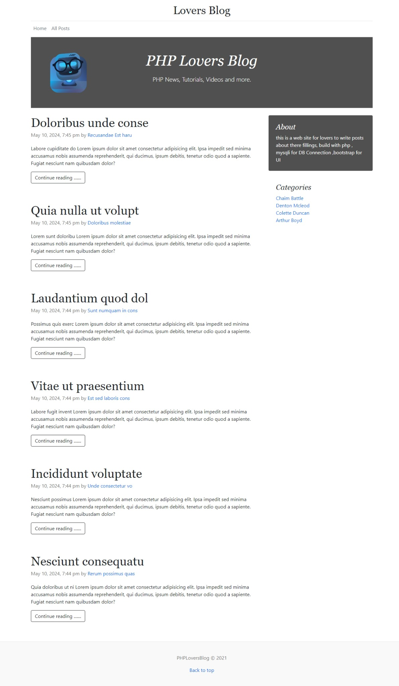
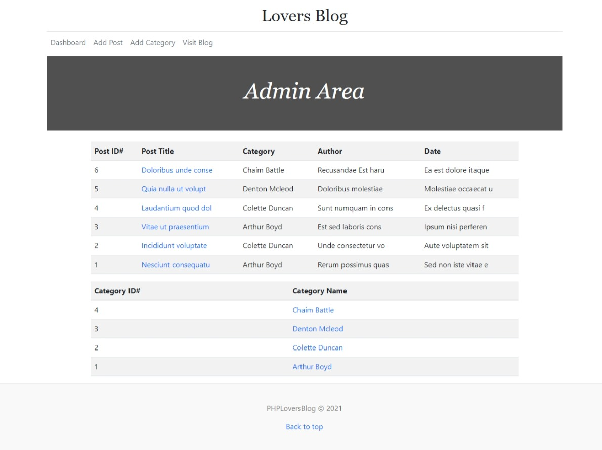

<h3>building Lovers Blog </h3>

Using php ,mysqli for DB Connection , bootstrap for UI 
  

This site contains an admin section for preforming (CRUD) operations on posts and categories , and guest section for viewing posts 
  
<h3>Home Page</h3>  
 
<h3>Post page</h3>  
 
<h3>Admin section</h3>  
 
<h3>Add Post</h3>  
 
<h3>Edit Post</h3>  
 
<h3>Add Category</h3>  
 

